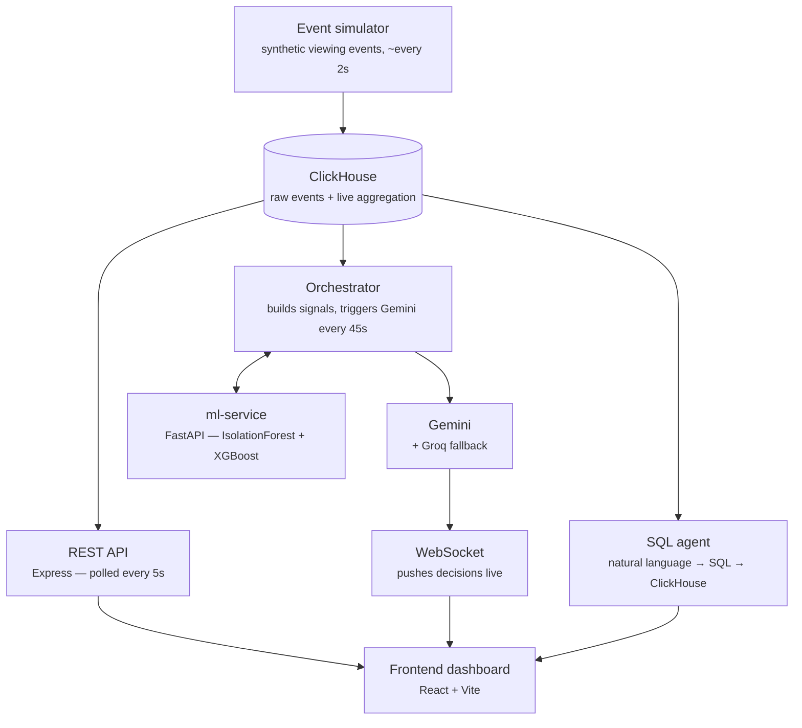

# Aurora

An agent that watches live audience data and surfaces production/distribution decisions before a human finishes reading the first graph.

Built for **[Agentic Cinema: The Blockbuster Hackathon](https://devpost.com)** (Google Cloud + partner ecosystem) — submitted under the **ClickHouse** partner track.

<!--
  TODO(you): drop a hero screenshot or short GIF of the dashboard right here, e.g.
  
-->

---

## Table of contents

- [Overview](#overview)
- [Architecture](#architecture)
- [Tech stack](#tech-stack)
- [Features](#features)
- [Screenshots](#screenshots)
- [Getting started](#getting-started)
- [Project structure](#project-structure)
- [Demo](#demo)
- [License](#license)
- [Acknowledgments](#acknowledgments)

---

## Overview

Aurora is a real-time audience analytics control room for a streaming catalog. It watches viewer behavior as it happens, flags anomalies the moment they emerge, and hands an autonomous agent (Gemini, on Google Cloud) the context it needs to recommend a production or distribution decision — before a human would even finish reading the underlying chart.

Under the hood, every viewing event lands in **ClickHouse** through a live ingestion pipeline (not a static fixture or a nightly batch): a `MergeTree` table for raw events, an `AggregatingMergeTree` fed continuously by a materialized view, and an agent loop that reads those aggregates every 45 seconds to decide whether Gemini should weigh in.

## Architecture



## Tech stack

| Layer | Technology |
|---|---|
| Frontend | React, Vite, TypeScript, Tailwind v4, shadcn/ui, Recharts |
| Backend | Express, TypeScript (NodeNext), WebSocket (`ws`) |
| Data store | **ClickHouse** (MergeTree + AggregatingMergeTree + materialized view) |
| ML service | FastAPI (Python), IsolationForest, XGBoost |
| Agent | Google Gemini (Gemini Enterprise), Groq (fallback) |

## Features

- **Live signal timeline** — viewer count and drop-off rate per title, refreshed every 5s
- **Regional breakdown** — per-region viewership and drop-off, filterable by title
- **Anomaly detection** — dual detector (relative baseline + IsolationForest), with detection and resolution timestamps, filterable by title/region
- **Agent recommendations** — Gemini-generated decisions (prioritize dubbing, recut scene, boost market, monitor), filterable by status, actionable in one click (accept/reject), pushed live over WebSocket
- **Natural language queries** — ask a question in plain language, get a generated (read-only, validated) SQL query against ClickHouse plus a plain-language answer
- **Drop-off prediction simulator** — XGBoost-backed prediction for a given title/region/device combination
- **Snapshot detail view** — paginated grid of every title/region pair, with a radial drop-off gauge, filterable by time window

## Screenshots

<!--
  TODO(you): add screenshots/GIFs for each major section. Suggested shots:
  - Full dashboard, light and dark mode
  - Signal + Detection (Timeline, Regional Breakdown, Anomalies)
  - Decision (Agent recommendations panel, mid-accept)
  - Explore (Natural Query + Drop-off predictor)
  - Detail (Snapshot grid with pagination)

  
  
  
-->

## Getting started

### Prerequisites

- Node.js (version — *fill in*)
- Python 3.x (for `ml-service`)
- A running ClickHouse instance (local via Docker, or hosted)
- A Gemini API key (Google AI Studio or Vertex AI)
- (Optional) a Groq API key, used as fallback

### Environment variables

Create a `.env` file in `backend/` (see `.env.example`):

```env
PORT=3001
CLICKHOUSE_URL=http://localhost:8123
CLICKHOUSE_USER=default
CLICKHOUSE_PASSWORD=
CLICKHOUSE_DB=aurora
ML_SERVICE_URL=http://localhost:8000
ORCHESTRATOR_INTERVAL_MS=45000
ANOMALY_SCORE_THRESHOLD=1.0
GEMINI_API_KEY=
GROQ_API_KEY=
```

<!-- TODO(you): confirm the exact variable names once ml-service and gemini.ts are finalized. -->

### Database setup

```bash
# apply the schema (raw events table, aggregate table, materialized view)
clickhouse-client < backend/clickhouse/migrations/001_schema.sql
```

### Run it

```bash
# 1. backend
cd backend
npm install
npm run dev

# 2. ml-service
cd ml-service
pip install -r requirements.txt
uvicorn main:app --reload --port 8000

# 3. frontend
cd frontend
npm install
npm run dev

# 4. event simulator (populates ClickHouse with live synthetic data)
cd backend
npm run simulate   # runs eventGenerator.ts
```

## Project structure

```
Aurora/
├── backend/                     Express + TypeScript (NodeNext)
│   ├── index.ts                  API routes (snapshot, timeline, regional, anomalies, predict, query/natural)
│   ├── clickhouse/
│   │   ├── client.ts              ClickHouse connection
│   │   ├── queries.ts             getCurrentSnapshot, getAudienceTimeline, getRegionalBreakdown, getAnomaliesRelative
│   │   └── migrations/001_schema.sql
│   ├── agent/
│   │   ├── orchestrator.ts        45s cycle — decides when to call Gemini
│   │   ├── decisionEngine.ts      generates AgentDecision objects
│   │   ├── gemini.ts              Gemini client (+ Groq fallback)
│   │   ├── sqlAgent.ts            natural language → SQL → ClickHouse → plain-language answer
│   │   └── eventGenerator.ts      synthetic event simulator, live insert into ClickHouse
│   └── ws/server.ts               WebSocket — broadcastDecision, onClientAction
├── ml-service/                   FastAPI (Python), port 8000
│   └── (IsolationForest + XGBoost — /anomalies, /predict/dropoff)
├── frontend/                     Vite + React, Tailwind v4 + shadcn/ui
│   └── src/
│       ├── main.tsx
│       ├── App.tsx                layout, header, section headings
│       ├── index.css              design tokens (light/dark)
│       ├── api/client.ts
│       └── components/
│           ├── ThemeSwitch.tsx
│           ├── RadialGauge.tsx
│           ├── Timeline.tsx
│           ├── RegionalBreakdown.tsx
│           ├── Anomalies.tsx
│           ├── RecommendationsPanel.tsx
│           ├── NaturalQuery.tsx
│           ├── DropoffPredictor.tsx
│           └── Snapshot.tsx
└── packages/shared/src/types.ts
```

## Demo

<!--
  TODO(you): 3-minute demo video (YouTube/Vimeo, public, English or English subtitles), required for submission.
  [Watch the demo](YOUR_VIDEO_URL_HERE)
-->

<!-- TODO(you): hosted project URL, required for submission. -->

## License

MIT

## Acknowledgments

- [Google Gemini](https://ai.google.dev/) — decision-making agent
- [ClickHouse](https://clickhouse.com/) — real-time event ingestion and aggregation
- [Groq](https://groq.com/) — fallback inference