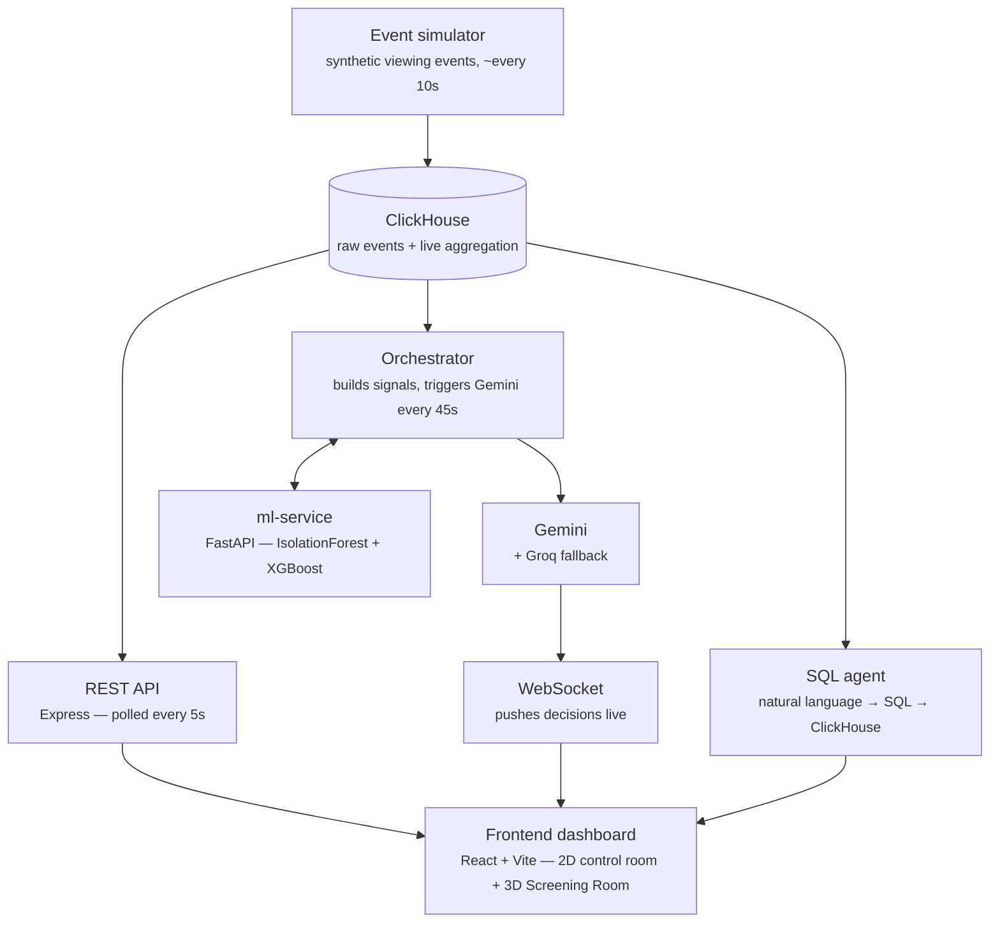

# Aurora

An agent that watches live audience data and surfaces production/distribution decisions before a human finishes reading the first graph.

Built for **[Agentic Cinema: The Blockbuster Hackathon](https://devpost.com)** (Google Cloud + partner ecosystem) — submitted under the **ClickHouse** partner track.

<!--
  TODO(you): drop a hero screenshot or short GIF of the dashboard right here, e.g.
  
-->

---

## Table of contents

- [Overview](#overview)
- [Architecture](#architecture)
- [Tech stack](#tech-stack)
- [Features](#features)
- [Screenshots](#screenshots)
- [Getting started](#getting-started)
- [Project structure](#project-structure)
- [Demo](#demo)
- [License](#license)
- [Acknowledgments](#acknowledgments)

---

## Overview

Aurora is a real-time audience analytics control room for a streaming catalog. It watches viewer behavior as it happens, flags anomalies the moment they emerge, and hands an autonomous agent (Gemini, on Google Cloud) the context it needs to recommend a production or distribution decision — before a human would even finish reading the underlying chart.

Under the hood, every viewing event lands in **ClickHouse** through a live ingestion pipeline (not a static fixture or a nightly batch): a `MergeTree` table for raw events, an `AggregatingMergeTree` fed continuously by a materialized view, and an agent loop that reads those aggregates every 45 seconds to decide whether Gemini should weigh in.

Beyond the 2D control room, Aurora also ships **The Screening Room** — an alternative 3D view where each title is rendered as a glowing sphere on a lit platform, and the agent itself is embodied in the scene: it drifts toward whichever title it's currently evaluating and surfaces its finding right there, with one-click accept/reject.

## Architecture



## Tech stack

| Layer | Technology |
|---|---|
| Frontend | React, Vite, TypeScript, Tailwind v4, shadcn/ui, Recharts, Three.js (react-three-fiber + drei) |
| Backend | Express, TypeScript (NodeNext), WebSocket (`ws`) |
| Data store | **ClickHouse** (MergeTree + AggregatingMergeTree + materialized view) |
| ML service | FastAPI (Python), IsolationForest, XGBoost |
| Agent | Google Gemini (Gemini Enterprise), Groq (fallback) |

## Features

- **Live signal timeline** — viewer count and drop-off rate per title, refreshed every 5s
- **Regional breakdown** — per-region viewership and drop-off, filterable by title
- **Anomaly detection** — dual detector (relative baseline + IsolationForest), with detection and resolution timestamps, filterable by title/region
- **Agent recommendations** — Gemini-generated decisions (prioritize dubbing, recut scene, boost market, monitor), filterable by status, actionable in one click (accept/reject), pushed live over WebSocket
- **The Screening Room (3D mode)** — an immersive alternative view: each title rendered as a glowing sphere on a lit platform, sized by viewer count and colored by anomaly state, with real movie posters floating above as cards. An embodied agent orb drifts to whichever title Gemini is currently evaluating and surfaces its finding — with accept/reject actions — directly in the scene.
- **Natural language queries** — ask a question in plain language, get a generated (read-only, validated) SQL query against ClickHouse plus a plain-language answer
- **Drop-off prediction simulator** — XGBoost-backed prediction for a given title/region/device combination
- **Snapshot detail view** — paginated grid of every title/region pair, with a radial drop-off gauge, filterable by time window

## Screenshots

<!--
  TODO(you): add screenshots/GIFs for each major section. Suggested shots:
  - Full dashboard, light and dark mode
  - Signal + Detection (Timeline, Regional Breakdown, Anomalies)
  - Decision (Agent recommendations panel, mid-accept)
  - Explore (Natural Query + Drop-off predictor)
  - Detail (Snapshot grid with pagination)
  - The Screening Room (3D mode, agent orb mid-decision with the overlay open)

  
  
  
  
-->

## Getting started

### Prerequisites

- Node.js 18+
- Python 3.x (for `ml-service`)
- A running ClickHouse instance (local via Docker, or hosted — we use ClickHouse Cloud)
- A Gemini API key (Google AI Studio or Vertex AI)
- (Optional) a Groq API key, used as fallback
- A TMDB API key, used to fetch real poster art and titles for the 6 pinned demo titles (optional — falls back to fictional titles/no posters if unset)

### Environment variables

Create a `.env` file in `backend/` (see `.env.example`):

```env
PORT=3000
CLICKHOUSE_URL=https://your-instance.clickhouse.cloud:8443
CLICKHOUSE_USER=default
CLICKHOUSE_PASSWORD=
CLICKHOUSE_DB=aurora
ML_SERVICE_URL=http://localhost:8000
ORCHESTRATOR_INTERVAL_MS=45000
ANOMALY_SCORE_THRESHOLD=0.5
GEMINI_API_KEY=
GROQ_API_KEY=
TMDB_API_KEY=
```


### Database setup

```bash
# apply the schema (raw events table, aggregate table, materialized view)
clickhouse-client < infra/clickhouse/init/001_schema.sql
clickhouse-client < infra/clickhouse/init/002_add_poster_url.sql
```

Both `audience_events` and `audience_stats_agg` have a 1-hour TTL, so ClickHouse purges old rows automatically — no manual cleanup needed in normal operation.

### Run it

```bash
# 1. backend + event simulator (run together via concurrently)
cd backend
npm install
npm run dev

# 2. ml-service
cd ml-service
pip install -r requirements.txt
uvicorn main:app --reload --port 8000

# 3. frontend
cd frontend
npm install
npm run dev
```

`npm run dev` in `backend/` starts both the Express server and the synthetic event simulator (`src/simulator/eventGenerator.ts`) side by side — no separate step needed. Run `npm run simulate` on its own if you ever want the simulator without the server.

## Project structure
Aurora/
├── backend/ Express + TS (NodeNext)
│ ├── src/
│ │ ├── index.ts API routes (snapshot, timeline, regional, anomalies, titles, predict, query/natural)
│ │ ├── clickhouse/
│ │ │ ├── client.ts ClickHouse connection
│ │ │ ├── queries.ts getCurrentSnapshot, getAudienceTimeline, getRegionalBreakdown, getAnomaliesRelative, getTitleMetadata
│ │ │ └── run-migration.ts one-off script to run .sql files via the Node client
│ │ ├── agent/
│ │ │ ├── orchestrator.ts 45s cycle — builds signals, decides when to call Gemini
│ │ │ ├── decisionEngine.ts generates AgentDecision objects
│ │ │ ├── gemini.ts Gemini client (+ Groq fallback), per-model throttling
│ │ │ ├── sqlAgent.ts natural language → SQL → ClickHouse → plain-language answer
│ │ │ └── simulator/
│ │ │ └── eventGenerator.ts synthetic event simulator, TMDB-backed titles/posters, live insert into ClickHouse
│ │ └── ws/server.ts WebSocket — broadcastDecision, onClientAction
│ └── .env Gemini/Groq/TMDB keys, ClickHouse credentials
├── ml-service/ FastAPI (Python), port 8000
│ └── app/ anomaly.py (IsolationForest), dropoff_model.py (XGBoost), queries.py, clickhouse_client.py, config.py, main.py
├── frontend/ Vite + React, Tailwind v4 + shadcn/ui
│ └── src/
│ ├── App.tsx layout, header, 2D/3D mode toggle
│ ├── index.css design tokens (light/dark/system)
│ ├── api/client.ts
│ ├── hooks/useAgentSocket.ts
│ ├── types/audience.ts
│ └── components/
│ ├── ThemeSwitch.tsx
│ ├── RadialGauge.tsx
│ ├── Timeline.tsx
│ ├── RegionalBreakdown.tsx
│ ├── Anomalies.tsx
│ ├── RecommendationsPanel.tsx
│ ├── NaturalQuery.tsx
│ ├── DropoffPredictor.tsx
│ ├── Snapshot.tsx
│ ├── MarqueeLights.tsx
│ ├── MarqueeTicker.tsx
│ └── Scene3D.tsx The Screening Room — 3D scene (spheres, platform, camera, posters, agent orb)
├── packages/shared/src/types.ts AgentDecision and other shared types
├── infra/clickhouse/init/ 001_schema.sql, 002_add_poster_url.sql
├── docker-compose.yml
├── LICENSE
└── README.md


## Demo


## License

MIT

## Acknowledgments

- [Google Gemini](https://ai.google.dev/) — decision-making agent
- [ClickHouse](https://clickhouse.com/) — real-time event ingestion and aggregation
- [Groq](https://groq.com/) — fallback inference
- [TMDB](https://www.themoviedb.org/) — real movie titles and poster art for the demo catalog